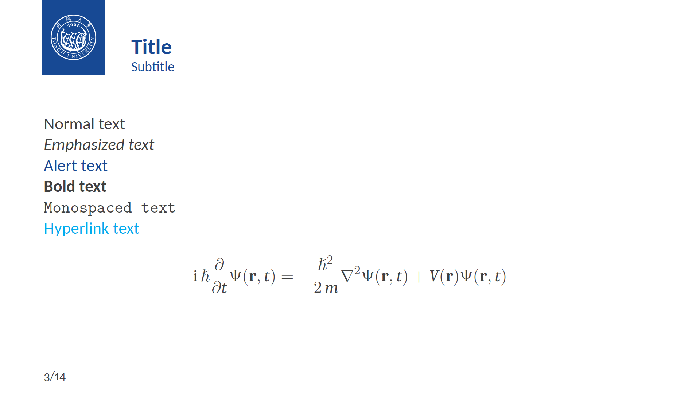
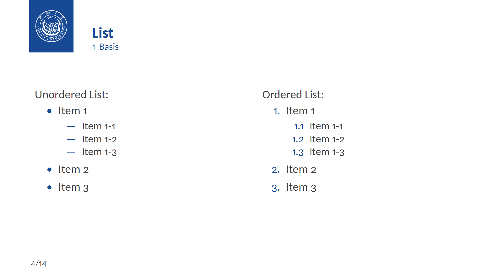
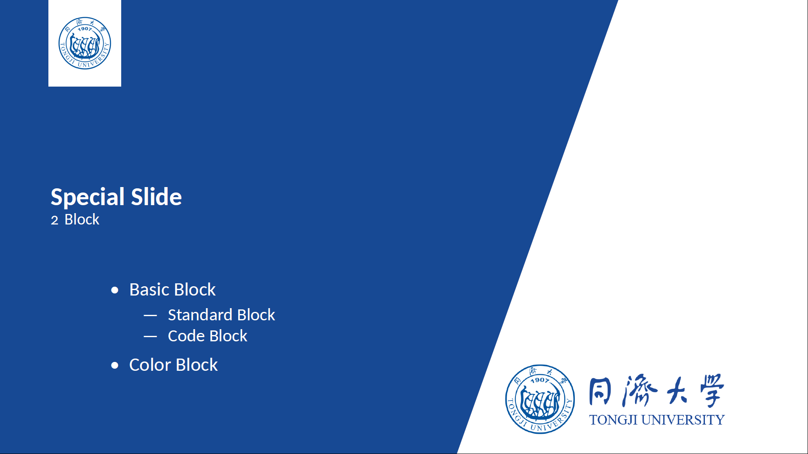
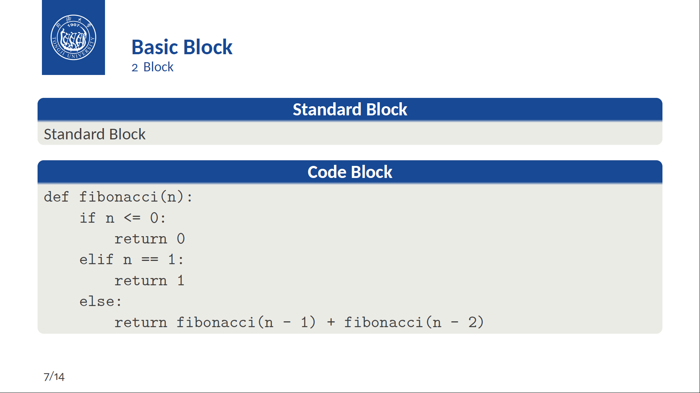
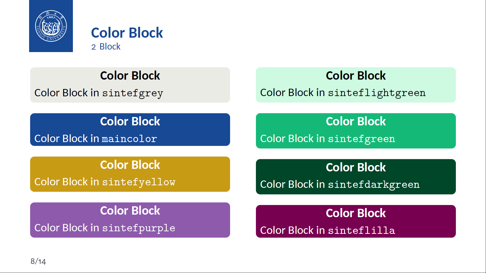
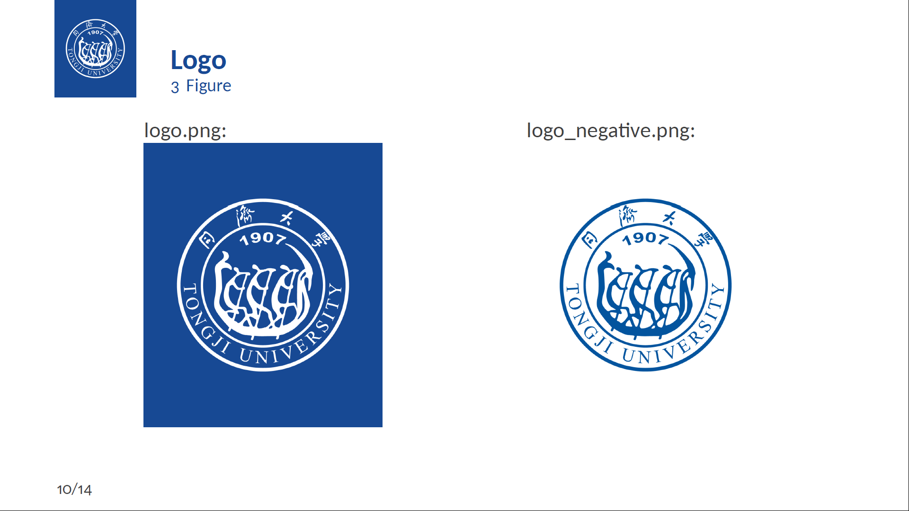

# Tongji University Beamer Template

## 仓库名称

Tongji_University_Beamer_Template

## 仓库简介

Tongji university Beamer template.

同济大学演示文稿模板。

## 仓库组成

## 模板展示

<p align="center">
  
  
  
  
  
  
  
  
  
</p>

## 编译项目

```
Usage: make [options]

Options:
  - all      Use xelatex to compile the LaTeX document.
  - clean    Clean temporary files.
  - help     Show this help message.

Note: make without any option is equivalent to make all.
```

## 致谢

Special thanks to [Federico Zenith](mailto:federico.zenith@sintef.no) for providing the [SINTEF Presentation](https://www.overleaf.com/latex/templates/sintef-presentation/jhbhdffczpnx) template, and to Liu Qilong for developing the derivative project [Beamer-LaTeX-Themes](https://github.com/TOB-KNPOB/Beamer-LaTeX-Themes). Additionally, many thanks to [wzl-plasmid](https://github.com/wzl-plasmid) for contributing to the style adaptations. This project builds upon these excellent works, and we extend our gratitude to all developers in the open-source community for their support and contributions.

特别感谢 [Federico Zenith](mailto:federico.zenith@sintef.no) 提供的 [SINTEF Presentation](https://www.overleaf.com/latex/templates/sintef-presentation/jhbhdffczpnx) 模板，以及 [Liu Qilong](mailto:qilong-kirov.liu@outlook.com) 开发的 [Beamer-LaTeX-Themes](https://github.com/TOB-KNPOB/Beamer-LaTeX-Themes) 派生版本。同时，也感谢 [wzl-plasmid](https://github.com/wzl-plasmid) 对模板样式的贡献。本项目在这些优秀作品的基础上进行了改进，感谢开源社区所有开发者的支持与贡献。

## 文档更新日期

2024年11月12日